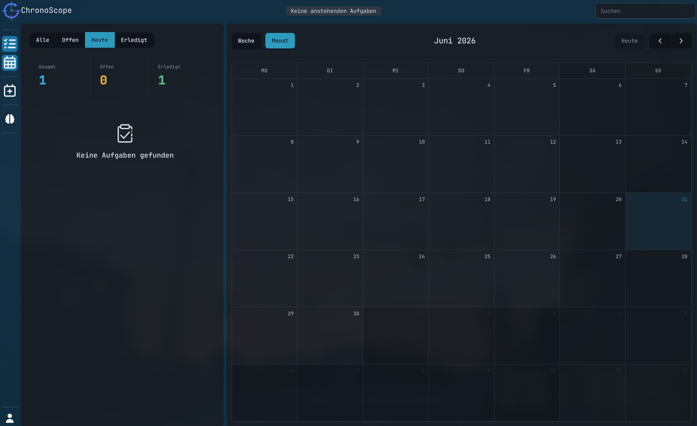
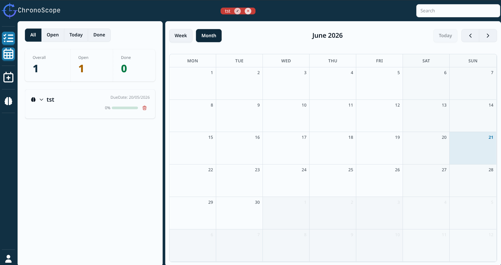
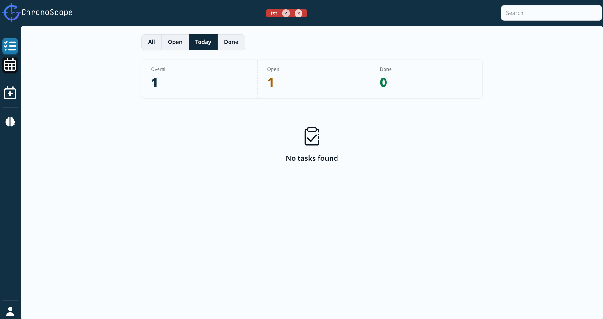
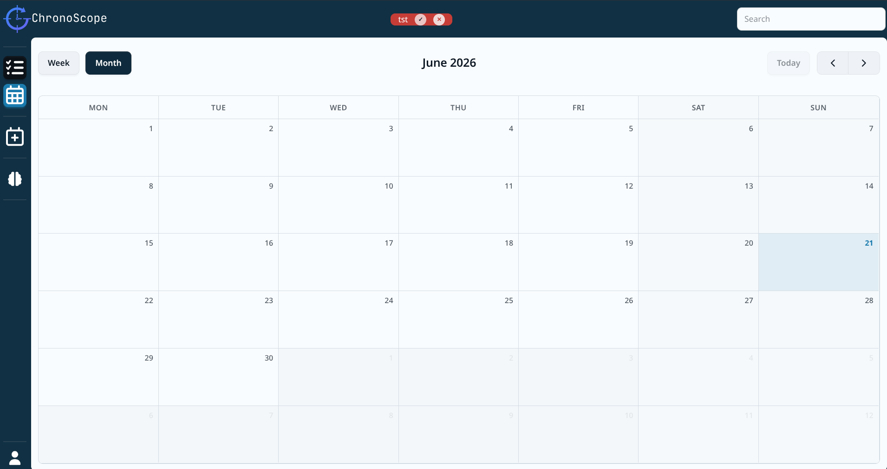
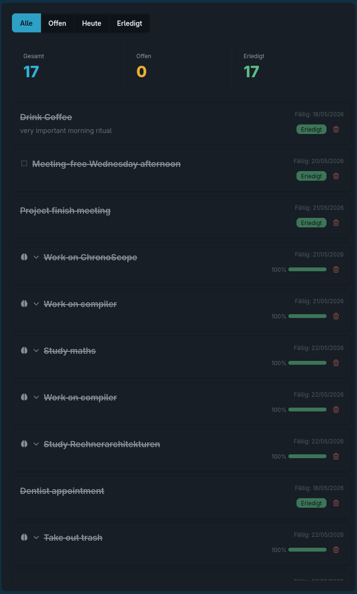
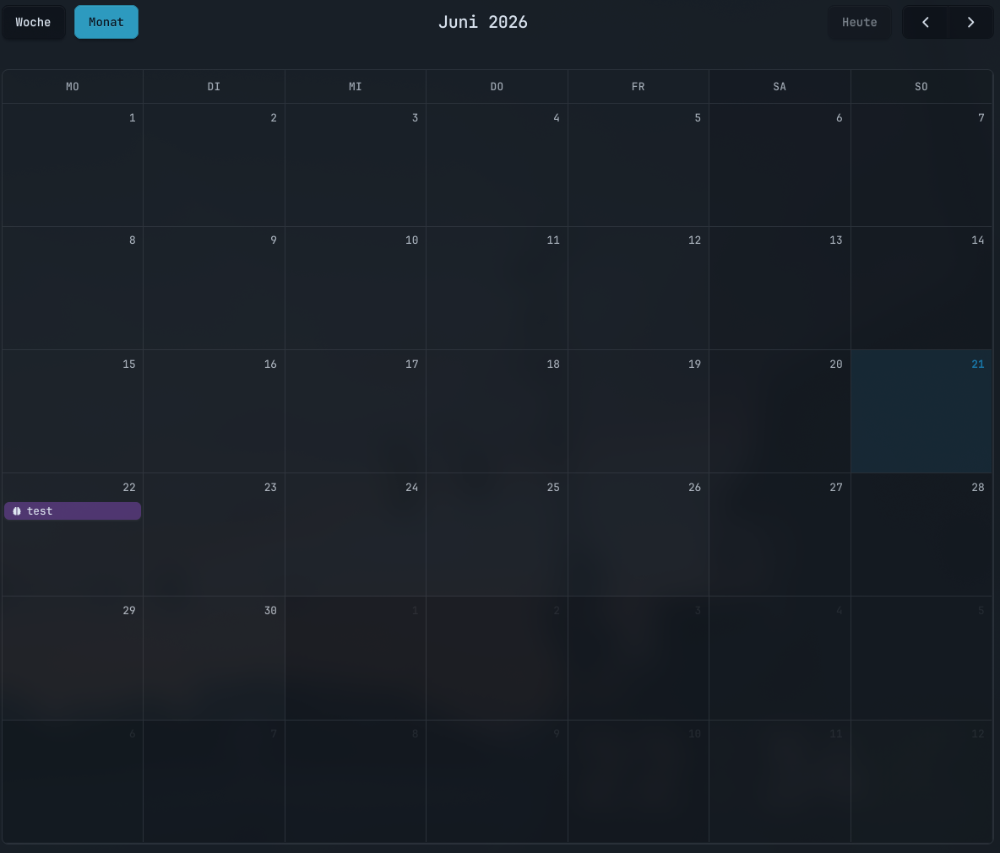
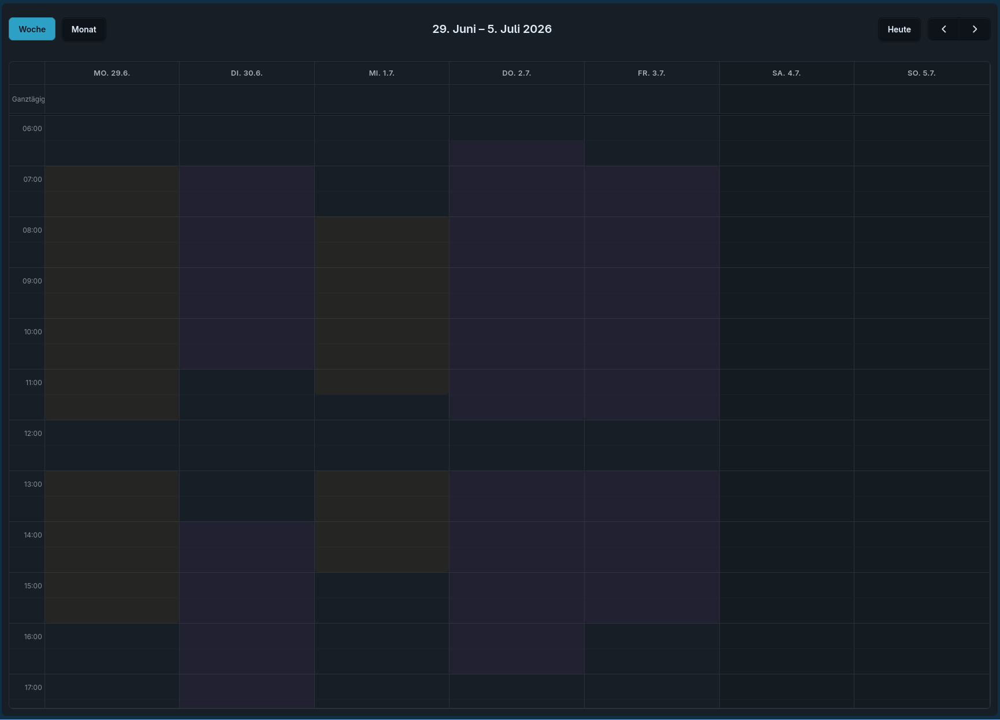
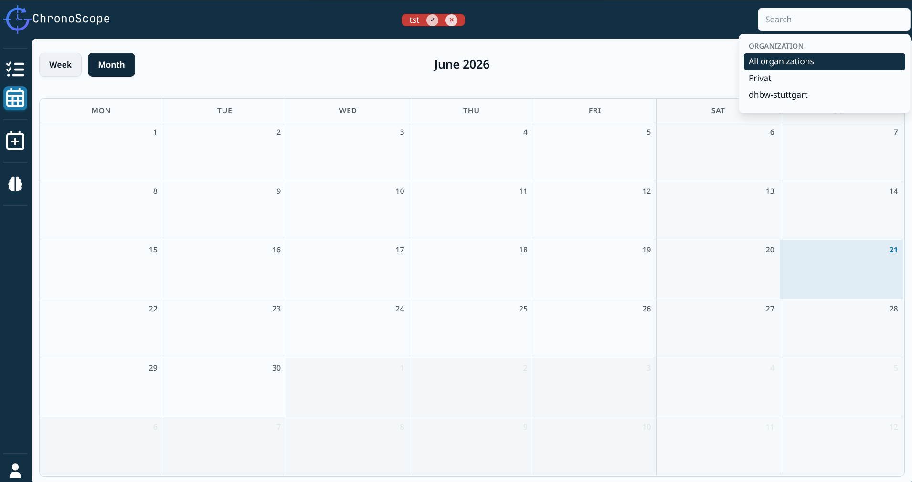
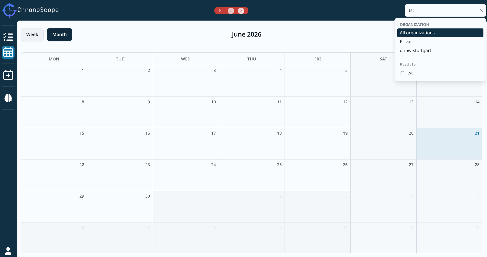

# Oberfläche verstehen

Die Chronoscope Oberfläche zeigt, wann Aufgaben, Termine und Blocker geplant sind. Es ist die zentrale Ansicht, um den automatisch erzeugten Arbeitsplan zu prüfen und anzupassen und besteht aus mehreren Elementen, wie einer Liste und einem Kalender.

## Auflistung der Elemente der Oberfläche
- Statusanzeige
- Ansichtsnavigation
- Suchfeld & Filter
- Aufgabe erstellen
- Planungsknopf
- Profil

## Statusanzeige

Im zentralen Oberen Bereich der Chronoscope Oberfläche ist die Statusanzeige zu finden. Hier wird dem User die gerade zu bearbeitende Aufgabe angezeigt. Handelt es sich um eine vom Algorithmus eingeplante Aufgabe, kann sie dort durch die angezeigten Knöpfe entweder quitiert werden oder wenn sich die Aufgabe dem eingeplantem Ende nähert noch um 5 minuten verlängert werden. Bei einer Verlängerung der laufenden Aufgabe, werden alle darauffolgende Aufgaben dementsprechend angepasst.

## Ansichtsnavigation

An der linken Seite der Oberfläche befinden sich mehrere Knöpfe für den Benutzer, darunter auch die Knöpfe zum umschalten der Ansichten. Es gibt drei Variationen für die Ansicht der Oberfläche. Die Standard Ansicht, ist die am Anfang gezeigt geteilte Ansicht von Liste und Kalender. Die Ansichten werden durch eine verschiedene Hervorhebung als aktiviert und deaktiviert gekennzeichnet und können durch anklicken umgeschaltet werden. Dadurch ergeben sich die zwei anderen Möglichkeiten der Ansichten und zwar eine Ansicht, die nur eine Liste und eine andere, die nur einen Kalender zeigt.

### Listenansicht

Die Listenansicht zeigt alle Aufgaben in chronologischer Reihenfolge nach dem Fälligkeitsdatum an und bietet einige Filter an. Sie kann auch genutzt werden, um dynamische Aufgaben nach dem Abschließen zu quittieren.

### Kalenderansicht

Der Kalender hat eine wöchentliche und eine monatliche Ansicht, die mit den Pfeilknöpfen navigiert werden können. In der Wochenansicht sind außerdem die Arbeitszeiten farbig hinterlegt.

## Suchfeld & Filter

Im oberen rechten Eck der Oberfläche befindet sich ein Suchfeld, welches dem Benutzer ermöglicht nach Organisationen, in der der Benutzer Mitglied ist, zu filtern.

Desweitern kann man in dem Suchfeld nach Namen oder Labels suchen. Im unteren Bereich werden Vorschläge für den Benutzer angezeigt und durch anklicken, wird entweder zum gesuchten Element gesprungen oder ein Filter für das ausgewählte Label gesetzt. Durch betätigen des X am Rand der Suchleiste, kann der Labelfilter wieder entfernt werden.

## Aufgabe erstellen

Durch den Knopf an der linken Seite mit einem Plus, kann eine neue Aufgabe erstellt werden. Eine genauere Beschreibung für das Anlegen einer Aufgabe findest du [hier.](tasks.md).

## Aufgaben einplanen

Normalerweise, wird der Algorithmus nach der Erstellung einer Aufgabe automatisch aufgerufen, kann aber durch das Betätigen des Gehirn-Symbol-Knopf an der linken Seite manuell aufgerufen werden.

## Profil

An der unteren linken Ecke befindet sich der Profilknopf. Hier kann sich der User entweder von unserer Anwendung abmelden oder die Einstellungen erreichen. Weitere Informationen zu den Einstellungen findest du im [nächsten Abschnitt.](settings.md)