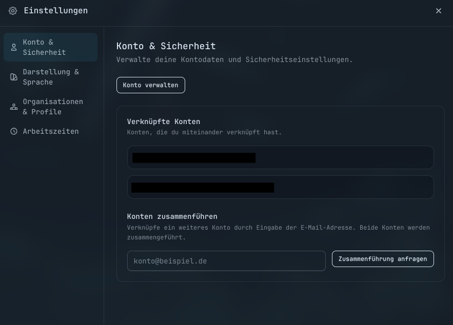
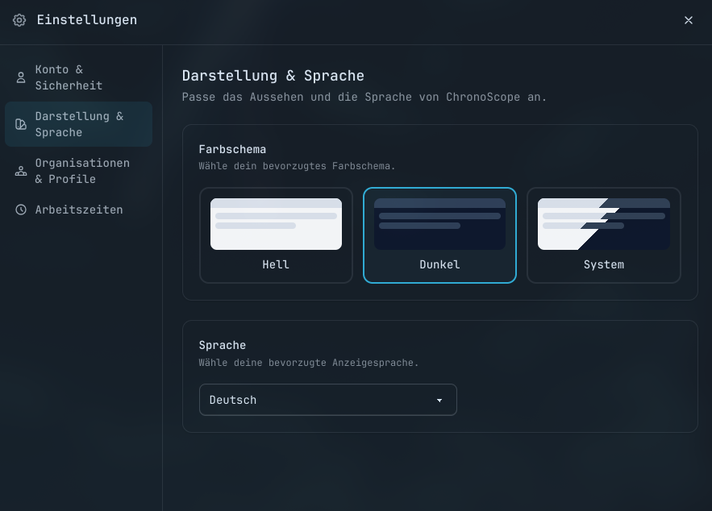
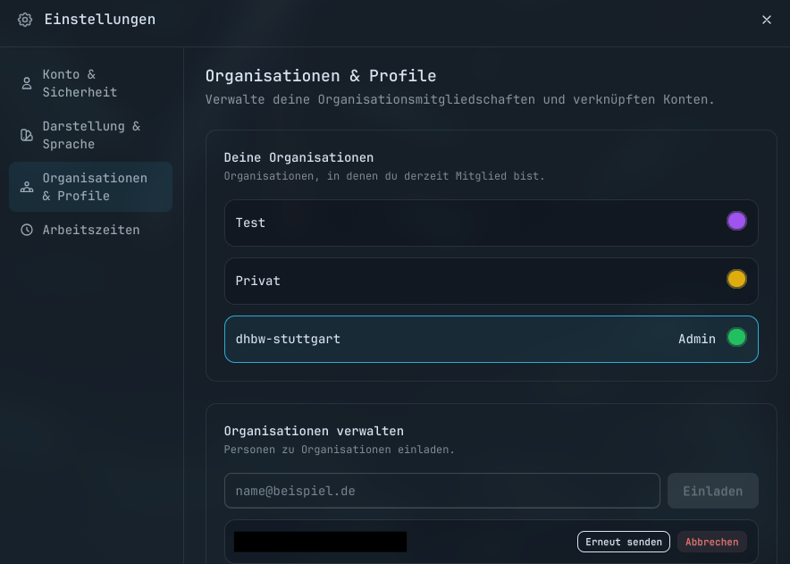
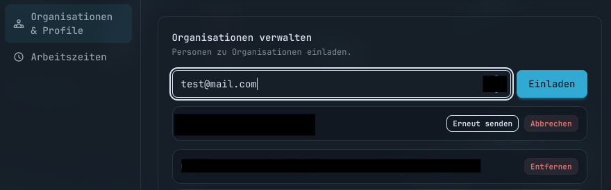
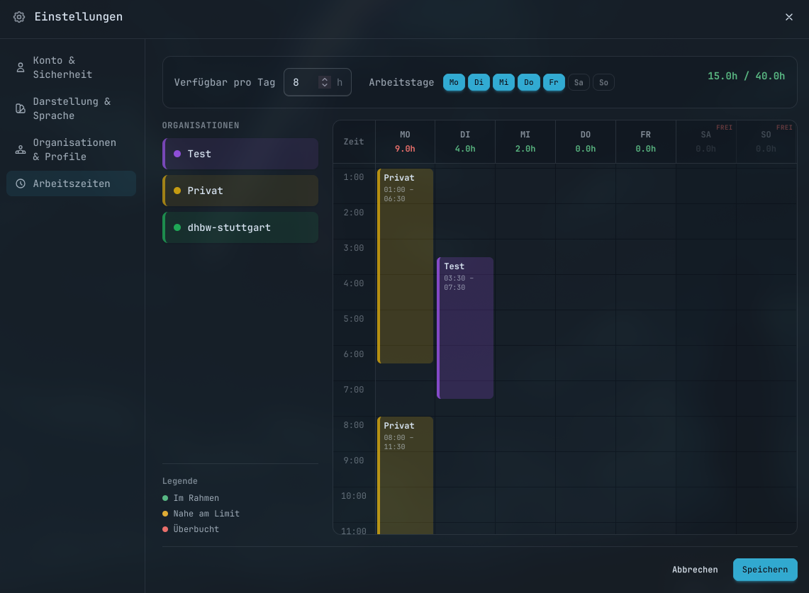

# Einstellungen verstehen

## Konto & Sicherheit

Im Bereich "Konto & Sicherheit" kannst du deine verknüpften Konten einsehen und ein neues Konto verknüpfen.

Hier kannst du auch mehrere Konten zusammenführen um Aufgaben über mehrere Organisationen hinweg zu verwalten.
Dafür einfach die E-Mail-Adresse des Organisationskontos eingeben und auf "Zusammenführen" klicken.
Es wird eine E-Mail an das Konto verschickt, welche dann von diesem Konto aus bestätigt werden muss bevor das Zusammenführen beginnt.

!!! warning "Achtung"
    Diese Zusammenführung kann nicht Rückgängig gemacht werden.
    Sichere deine Einstellungen um sie danach wieder gerade ziehen zu können.

## Darstellung & Sprache

Der Bereich "Darstellung & Sprache" erlaubt dir die Oberfläche nach deinen Wünschen ein zu stellen.

## Organisationen & Profile

Unter "Organisationen & Profile" kannst du die mit deinem Account verbundenen Organisationen einsehen.
Hier kannst du auch die Farbe der Organisation ändern durch klicken auf die entsprechende Farb-Kugel.

Auch kannst du - wenn du ein Organisations-Administrator bist - die Benutzer in deiner Organisation verwalten.

Mit der E-Mail-Adresse können entsprechende Accounts eingeladen werden.
Diese erhalten dann eine E-Mail mit einem Link über den sie den Beitritt bestätigen können.
Die Einladungen können auch erneut gesendet oder abgebrochen werden mit den entsprechenden Schaltflächen.
Sollte ein Benutzer entfernt werden müssen, kann dies hier auch getan werden.

## Arbeitszeiten

Der letzte Bereich "Arbeitszeiten" lässt einen Arbeitszeiten festlegen.

Hier kann man einstellen, wie viele Stunden pro Tag gearbeitet wird und an welchen Wochentagen gearbeitet wird.
Dann einfach per Drag-and-Drop die Organisation in die Zeiträume rein ziehen, für die gearbeitet wird.
Diese Zeiträume werden dann verwendet, um Aufgaben automatisch zu verplanen.
Beispielsweise kannst du einstellen, dass du von 10 bis 15 Uhr Montags und von 7 bis 12 Uhr Dienstags arbeitest und entsprechend die Arbeitsslots rein ziehen.
Der Planer gibt dir oben an, wie viel Arbeitszeit pro Tag bereits eingeplant ist.