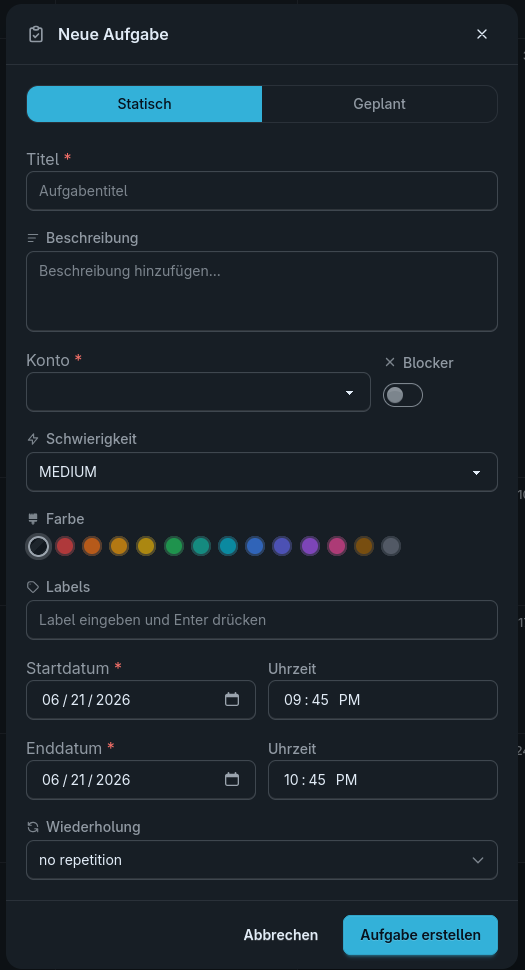
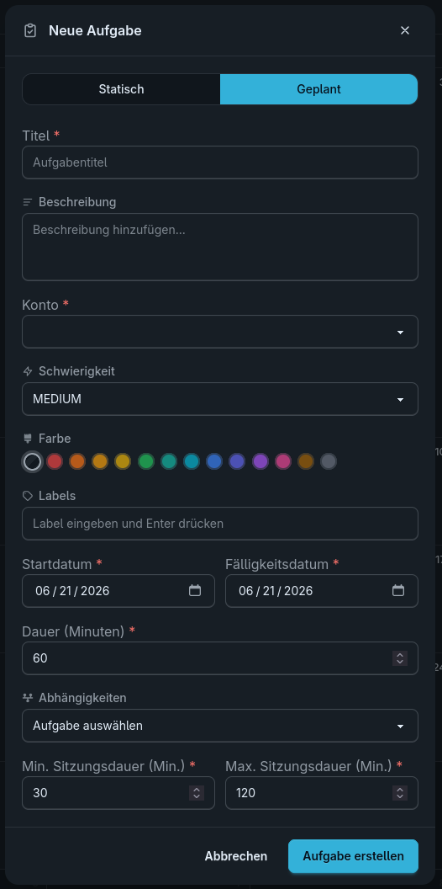

# Aufgaben verstehen

Aufgaben sind die zentralen Elemente in ChronoScope. Sie beschreiben Arbeit, die erledigt werden soll, und liefern dem Planungsalgorithmus die Informationen, die er für eine sinnvolle Einplanung braucht.

## Statische Termine und Blocker erstellen

Feste Termine haben eine konkrete Start- und Endzeit. Blocker markieren Zeiten, in denen ChronoScope keine Aufgaben einplanen soll.

### Angaben

| Angabe | Bedeutung |
| --- | --- |
| Titel | Kurzer Name der Aufgabe |
| Beschreibung | Zusätzliche Details für dich oder dein Team |
| Konto | Das Konto für das die Aufgabe angelegt wird |
| Blocker | Entscheidet, ob die Aufgabe als Blocker angelegt wird |
| Schwierigkeit | Einschätzung, wie anstrengend die Aufgabe ist |
| Farbe | Anzeigefarbe für die Aufgabe im Kalender |
| Label | Tags, die auf die Aufgabe zutreffen, nach denen später gesucht werden kann |
| Start- & Endzeit | Zeitraum, in dem die Aufgabe stattfindet |
| Wiederholung | Untermenü, in dem eine  Wiederholung eingestellt werden kann |

## Dynamische Aufgaben erstellen

Dynamische Aufgaben werden nach dem Erstellen automatisch in freie Arbeitszeiten eingeplant. Sie eignen sich für Arbeit, die flexibel verschoben werden darf.

### Angaben

| Angabe | Bedeutung |
| --- | --- |
| Titel | Kurzer Name der Aufgabe |
| Beschreibung | Zusätzliche Details für dich oder dein Team |
| Konto | Das Konto für das die Aufgabe angelegt wird |
| Schwierigkeit | Einschätzung, wie anstrengend die Aufgabe ist |
| Blocker | Entscheidet, ob die Aufgabe als Blocker angelegt wird |
| Farbe | Anzeigefarbe für die Aufgabe im Kalender |
| Label | Tags, die auf die Aufgabe zutreffen, nach denen später gesucht werden kann |
| Dauer | Geschätzter Arbeitsaufwand |
| Start- & Enddatum | Zeitraum, in dem die Aufgabe eingeplant werden soll |
| Abhängigkeiten | Aufgaben die abgeschlossen sein müssen bevor die Aufgabe begonnen wird |
| Minimale und maximale Sitzungsdauer | Minimale und maximale Zeit, die der Nutzer ununterbrochen an dieser Aufgabe arbeiten möchte |

## Nach dem Erstellen

Nach dem Erstellen einer Aufgabe taucht sie in der Kalender- und Listenansicht auf (geschweige denn die Planung einer dynamischen Aufgabe schlägt fehl). Der Nutzer kann diese aufrufen, um die angaben zu editieren, mit Ausnahme des Kontos, dieses ist nach dem Anlegen unveränderlich. Laufende und oder bevorstehende Aufgaben werden außerdem in einer Statusleiste am oberen Bildschirmrand angezeigt.
Der Kalender hat eine wöchentliche und eine monatliche Ansicht, die mit den Pfeilknöpfen navigiert werden können. In der Wochenansicht sind außerdem die Arbeitszeiten farbig hinterlegt.

Die Listenansicht zeigt alle Aufgaben in chronologischer Reihenfolge nach dem Fälligkeitsdatum an und bietet einige Filter an. Sie kann auch genutzt werden, um dynamische Aufgaben nach dem Abschließen zu quittieren.

Die Statusleiste gibt dem Nutzer eine weitere schnelle Möglichkeit eine dynamische Aufgabe zu quittieren, wenn im Moment eine Aufgabe laufend ist bzw. unquittiert ist und in der Vergangenheit liegt.

