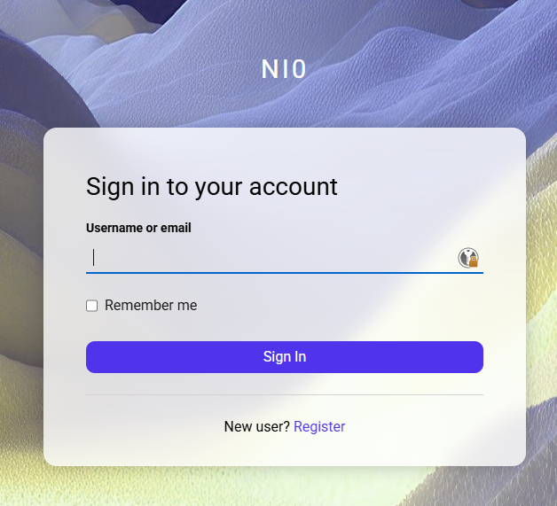
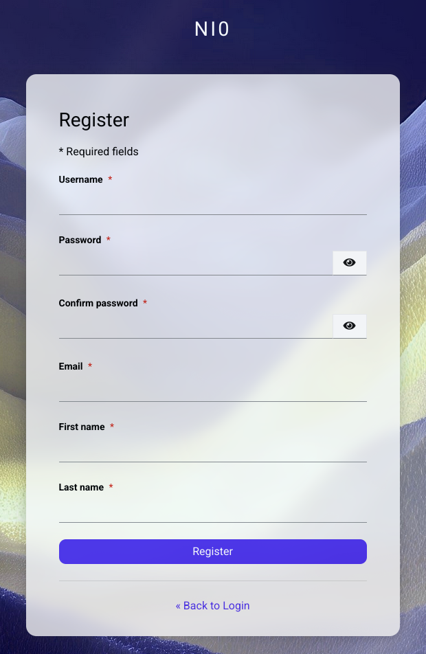
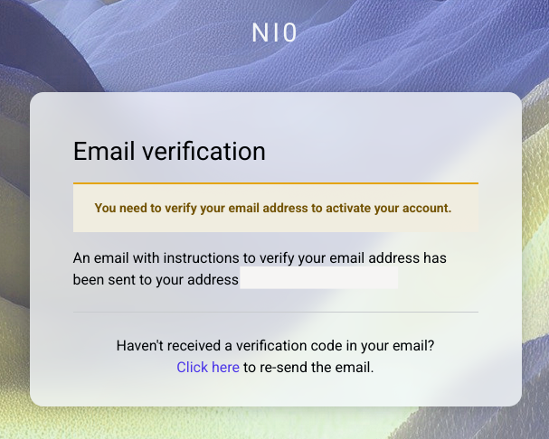

# Loslegen mit ChronoScope

Diese Anleitung hilft dir, ChronoScope für dich ein zu richten

## Account Registrieren

Zuerst solltest du ein Account registerieren.

!!! note "Beachte"
	Solltest du über deine Organisation einen Account bekommen, dann Gib einfach deine E-Mail Adresse ein.
	Du wirst automatisch zur Anmeldemaske deiner Organisation weiter geleitet und musst hier keinen neuen Account erstellen.

Dafür gehst du auf der Anmelde-Seite auf den Button "Registrieren":

Fülle entsprechend die Registrierungsmaske mit deinen Informationen aus:

Wichtig hierbei ist ein starkes Passwort zu verwenden und deine eigene E-Mail-Adresse.

Nachdem die Informationen ausgefüllt sind, wird an deine E-Mail-Adresse eine Nachricht mit einem Bestätigungslink geschickt.
Diesen entsprechend klicken um deinen Account zu verifizieren.

## Erster Ablauf

1. Melde dich in ChronoScope an.
2. Öffne deine Einstellungen und hinterlege deine Arbeitszeiten.
3. Erstelle deine ersten Aufgaben mit Titel, Dauer, Priorität und Deadline.
4. Lege feste Termine oder Blocker an, falls bestimmte Zeiten nicht verfügbar sind.
5. Starte die automatische Planung oder warte, bis ChronoScope nach einer Änderung neu plant.

!!! tip "Klein anfangen"
	Für den ersten Test reichen drei bis fünf Aufgaben. So erkennst du schneller, ob Arbeitszeiten, Deadlines und Prioritäten so wirken, wie du es erwartest.

## Danach

Der nächste gute Schritt ist das Tutorial [Deinen ersten Plan erstellen](tutorials/first-plan.md).
