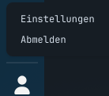

# Loslegen mit ChronoScope

Diese Anleitung hilft dir, ChronoScope für dich ein zu richten.

## Account Registrieren

Zuerst solltest du ein Account registerieren.

!!! warning "Beachte"
	Solltest du über deine Organisation einen Account bekommen, dann Gib einfach deine E-Mail Adresse ein.
	Du wirst automatisch zur Anmeldemaske deiner Organisation weiter geleitet und musst hier keinen neuen Account erstellen.

Dafür gehst du auf der Anmelde-Seite auf den Button "Registrieren":

Fülle entsprechend die Registrierungsmaske mit deinen Informationen aus:

Wichtig hierbei ist ein starkes Passwort zu verwenden und deine eigene E-Mail-Adresse.

Nachdem die Informationen ausgefüllt sind, wird an deine E-Mail-Adresse eine Nachricht mit einem Bestätigungslink geschickt.
Diesen entsprechend klicken um deinen Account zu verifizieren.

## Erster Ablauf

Melde dich in ChronoScope an.
Öffne deine Einstellungen indem du unten links auf das User-Icon klickst:

Im Bereich "Konto & Sicherheit" kannst du deine verknüpften Konten einsehen und ein neues Konto verknüpfen.

Hier kannst du auch mehrere Konten zusammenführen um Aufgaben über mehrere Organisationen hinweg zu verwalten.
Dafür einfach die E-Mail-Adresse des Organisationskontos eingeben und auf "Zusammenführen" klicken.
Es wird eine E-Mail an das Konto verschickt, welche dann von diesem Konto aus bestätigt werden muss bevor das Zusammenführen beginnt.

!!! warning "Achtung"
	Diese Zusammenführung kann nicht Rückgängig gemacht werden.
	Sichere deine Einstellungen um sie danach wieder gerade ziehen zu können.

Der Bereich "Darstellung & Sprache" erlaubt dir die Oberfläche nach deinen Wünschen ein zu stellen.

## Danach

Der nächste gute Schritt ist das Tutorial [Deinen ersten Plan erstellen](tutorials/first-plan.md).
