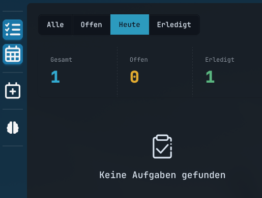

# Deinen ersten Plan erstellen

In diesem Tutorial legst du beispielhaft Aufgaben an und lässt ChronoScope daraus einen Arbeitsplan erzeugen. 

## Ziel

Am Ende hast du einen Kalender, in dem ChronoScope Aufgaben automatisch in freie Arbeitszeiten eingeplant hat.

## Voraussetzung

Du hast deine Arbeitszeiten in den [Einstellungen](../getting-started.md#Erster-Ablauf) hinterlegt.

## Wie lege ich Aufgaben an?

Klicke auf der linken Seite auf das Icon mit dem "+"-Zeichen:

Danach öffnet sich das Menü zum erstellen einer Aufgabe:

Hier kannst du einen Termin oder Blocker erstellen, der nicht vom Algorithmus verschoben oder überlagert wird.
Da wir aber einen automatisierten Plan erstellen wollen wechseln wir oben auf "Geplant" um.

Hier können wir eine Aufgabe erstellen.
Wichtig hierbei ist die Einstellung des Kontos und der Zeitspannen.
Das Konto bestimmt, zu welchen Arbeitszeiten die Aufgabe geplant wird.
Das Start- und Fälligkeitsdatum bestimmt, in welchem Zeitraum die Aufgabe geplant werden darf.
Die Dauer sowie die Min- und Max-Sitzungsdauer bestimmt, wie klein die Aufgabe automatisch unterteilt werden darf.

Weitere Infos findest du unter [Aufgaben verstehen](../concepts/tasks.md)

Sobald die Aufgabe erstellt wurde wird sie Automatisch von ChronoScope eingeplant.
Weitere Aufgaben können mit unterschiedlichen Deadlines und Prioritäten erstellt werden.
Jedesmal wird der Algorithmus nach der bestmöglichen Lösung suchen um die Aufgaben ausgewogen zu verteilen.

## Ergebnis

Ein guter erster Plan erfüllt diese Punkte:

- Aufgaben liegen innerhalb deiner Arbeitszeiten.
- Feste Termine und Blocker werden nicht überplant.
- Dringende Aufgaben erscheinen vor weniger dringenden Aufgaben.
- Nicht einplanbare Aufgaben werden sichtbar gemeldet.
